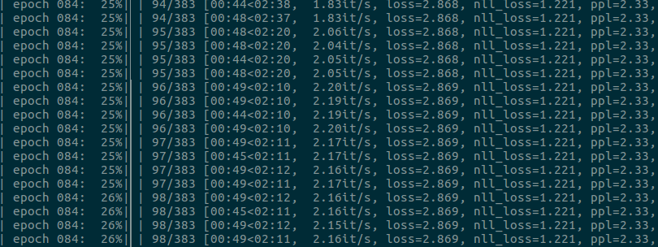

# fairseq-tensorboard

**NOTE**: the functionality in this library is already present in fairseq since commit
[257a3b8](https://github.com/pytorch/fairseq/commit/257a3b89edf359c1a2603ff7a841db6b926460bd)
(included in fairseq release 0.6.3).

---

This is a small utility to monitor fairseq training in tensorboard.

It is not a fork of fairseq, but just a small class that extends its
functionality with tensorboard logging.

## Installation and Usage

You just need to clone fairseq-tensorboard, install its only direct dependency
apart from fairseq itself
([tensorboardX](https://github.com/lanpa/tensorboardX)) and launch
fairseq's `train.py` specifying as task `monitored_translation`:

```
pip install tensorboardX

git clone https://github.com/noe/fairseq-tensorboard.git

python fairseq/train.py \
   --user-dir ./fairseq-tensorboard/fstb \
   --task monitored_translation [...]
```

## Features

- Logs fairseq training and validation losses.
- Saves sys.argv and fairseq's args for model traceability
  (see [this](https://twitter.com/Thom_Wolf/status/1106300583835766786)).
- Allows plotting training and validation losses in the same plot
  (see [this](https://github.com/tensorflow/tensorflow/issues/7089#issuecomment-295857875)).
- Supports multi-GPU training.

## FAQ

### Why should I use fstb ?

Because it allows you to visually diagnose your losses!

You would change this:



...into this:


### How can fairseq load fstb?

You have to provide fairseq with command line argument `--user-dir` with
the path of fstb. This instructs fairseq to load the fstb code, which
registers task `monitored_translation`.


### Does fstb work with multi-GPU training?

Yes, it has been tested with single-node multi-GPU training. Only the
first worker process logs to tensorboard. The behaviour of the
remaining workers is unaltered.
